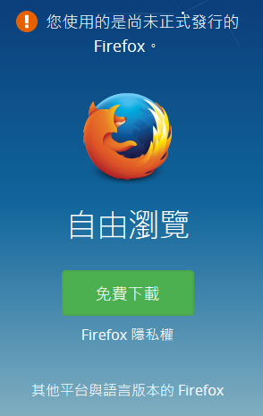
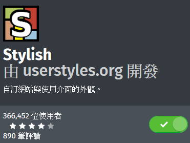
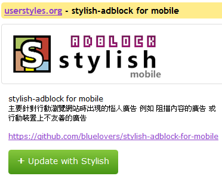

# stylish-adblock-for-mobile

```
stylish-adblock-for-mobile 主要針對行動瀏覽網站時出現的惱人廣告或介面
例如 阻擋內容的廣告 或 不友善的廣告
```

https://userstyles.org/styles/140097/stylish-adblock-for-mobile

- **目前只有 Firefox 手機板支援 Stylish 附加元件**
- 選擇以 Stylish 來達成去廣告的原因為 方便自由訂閱樣式

## issues

- 歡迎利用 [issues](https://github.com/bluelovers/stylish-adblock-for-mobile/issues) 回報網站廣告或相關錯誤
- 盡量附上截圖說明
- 由於是基於 css 處理 所以 css 做不到的事情必須要透過[其他附加元件](#其他附加元件)來達成

## 安裝說明

1. 安裝行動版 Firefox 或其他基於 Firefox 架構**能安裝附加元件**的瀏覽器 <br/>
([android](https://www.mozilla.org/zh-TW/firefox/android/))
([iphone/ios](https://www.mozilla.org/zh-TW/firefox/ios/))

2. 安裝 Stylish 附加元件 <br/>
https://addons.mozilla.org/zh-TW/android/addon/stylish/

3. 安裝 stylish-adblock-for-mobile <br/>
https://userstyles.org/styles/140097/stylish-adblock-for-mobile

### 安裝圖解

1. 沒什麼好解釋的，此步驟可直接經過 app 市集去安裝(例如 Google Play 商店)
<br/>

2. 將圖中綠色按鈕位置的按鈕啟動成綠色
<br/>

3. 必須要能看見以下綠色按鈕才是正確的
<br/>

## 其他附加元件

**搭配以下附加元件可強化功能** 
(以下皆為 Firefox 附加元件，必須透過 Firefox 安裝)

* [Adblock Plus](https://addons.mozilla.org/zh-TW/android/addon/adblock-plus/) - 老牌專業防廣告插件(**行動版缺點是不易訂閱樣式**)
* [usi (User|Unified Script Injector)](https://addons.mozilla.org/zh-TW/android/addon/userunified-script-injec.user.js) - **可安裝 userscript(.user.js)** 用來對網站做更多處理
此插件相當於 [Greasemonkey](https://addons.mozilla.org/en-US/firefox/addon/greasemonkey/)，[Tampermonkey](https://chrome.google.com/webstore/detail/tampermonkey/dhdgffkkebhmkfjojejmpbldmpobfkfo)
